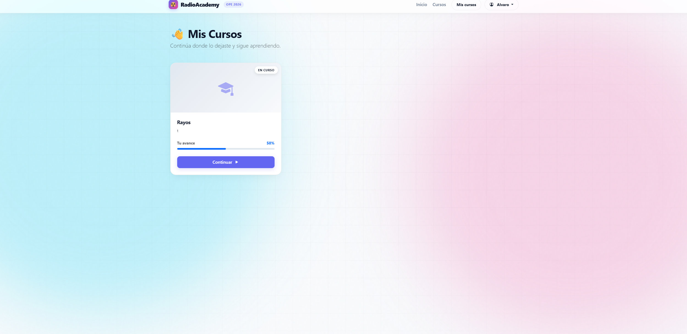
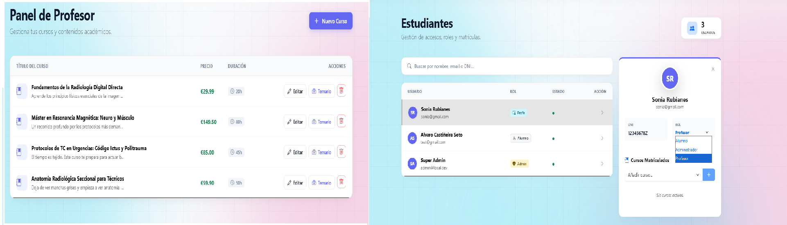
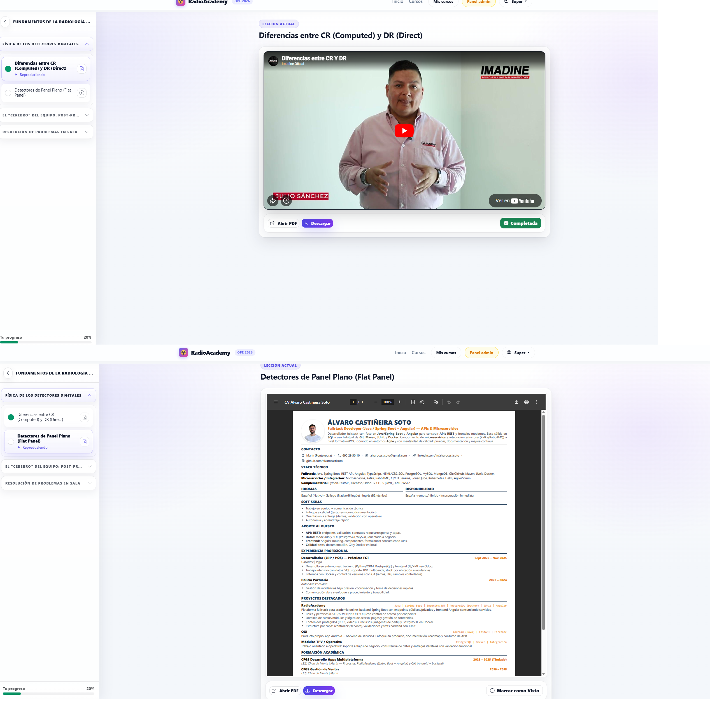

# 📻 RadioAcademy

**RadioAcademy** es un Sistema de Gestión de Aprendizaje (LMS) moderno y robusto, diseñado específicamente para la educación en el ámbito de la radio y el audio. Esta plataforma ofrece una solución integral para gestionar cursos, estudiantes, inscripciones y pagos, con un enfoque especial en contenido multimedia enriquecido.

---

## 📸 Galería de Capturas

Aquí puedes ver cómo luce la aplicación. *Nota: Puedes subir tus propias capturas a la carpeta `uploads/` y actualizar estos nombres.*

### 🎓 Vista del Estudiante
Una interfaz limpia y moderna donde los estudiantes pueden ver su progreso y acceder a sus cursos.


### 🛠️ Panel de Administración
Herramientas potentes para gestionar usuarios, cursos y contenido.


### 🎧 Reproductor Multimedia
Soporte nativo para lecciones de audio y video.


---

## 🚀 Características Principales

RadioAcademy no es solo un gestor de contenido, es una plataforma educativa completa:

### 🔐 Seguridad y Usuarios
- **Autenticación Robusta**: Implementación segura utilizando **JWT (JSON Web Tokens)** y Spring Security 6.
- **Control de Acceso Basado en Roles (RBAC)**: Diferenciación clara entre roles de `ADMIN` y `STUDENT`.
- **Gestión de Perfiles**: Los usuarios pueden gestionar su información personal y preferencias.

### 📚 Gestión Académica
- **Estructura Jerárquica**: Organización lógica de Cursos ➡️ Módulos ➡️ Lecciones.
- **Soporte Multimedia**: Capacidad para integrar archivos de audio y video directamente en las lecciones.
- **Recursos Descargables**: Los profesores pueden adjuntar material de apoyo (PDFs, docs).

### 📈 Progreso y Evaluación
- **Seguimiento Detallado**: Monitorización en tiempo real del porcentaje de completitud del curso.
- **Motor de Exámenes (Quizzes)**: Creación de evaluaciones para validar el conocimiento del estudiante.
- **Certificación Automática**: Generación dinámica de certificados en PDF al completar un curso con éxito.

### 💰 Monetización
- **Integración con Stripe**: Pasarela de pagos segura y eficiente.
- **Gestión de Inscripciones**: Control automático del acceso basado en el estado del pago.

### 📧 Comunicación
- **Notificaciones por Email**: Integración con **Resend** para correos transaccionales (bienvenida, recuperación de contraseña, confirmaciones).

---

## 🛠️ Stack Tecnológico

El proyecto está construido sobre cimientos sólidos utilizando las últimas tecnologías empresariales.

### Backend (Servidor)
- **Framework**: Spring Boot 3.2.4
- **Lenguaje**: Java 17
- **Base de Datos**: PostgreSQL 16 (Producción), H2 (Tests)
- **Persistencia**: Spring Data JPA / Hibernate
- **Migraciones**: Flyway
- **Seguridad**: Spring Security + JJWT
- **Utilidades**: Lombok, MapStruct (si aplica)

### Frontend (Cliente)
- **Framework**: Angular 21 (Última generación)
- **Estilos**: Bootstrap 5.3 (Diseño responsivo)
- **Lenguaje**: TypeScript
- **Testing**: Vitest

### Infraestructura & DevOps
- **Contenerización**: Docker & Docker Compose (para orquestación de DB)
- **Build Tools**: Maven (Backend), NPM/Angular CLI (Frontend)

---

## 📋 Prerrequisitos

Antes de comenzar, asegúrate de tener instalado el siguiente software en tu máquina:

1.  **Java JDK 17** o superior.
2.  **Node.js** (versión 18 LTS o superior recomendada).
3.  **Docker Desktop** (para levantar la base de datos PostgreSQL fácilmente).
4.  **Git** (para control de versiones).

---

## ⚡ Guía de Instalación y Ejecución

Sigue estos pasos para levantar el entorno de desarrollo local.

### 1. Clonar el Repositorio
```bash
git clone <url-del-repositorio>
cd Academia
```

### 2. Iniciar la Base de Datos
Utilizamos Docker Compose para iniciar una instancia de PostgreSQL configurada y lista para usar.
```bash
cd backend
docker-compose up -d
```
> Esto iniciará PostgreSQL en el puerto **5432** con usuario `admin` y contraseña `password123`.

### 3. Iniciar el Backend (Spring Boot)

#### 🖥️ Para Usuarios de Windows (Recomendado)
Hemos incluido un script automático que configura todas las variables de entorno necesarias y lanza la aplicación.
Simplemente ejecuta desde la carpeta `backend`:

```cmd
start_app.bat
```

#### 🐧 Para Linux / Mac (o ejecución manual)
Si prefieres hacerlo manualmente, exporta las variables y ejecuta con Maven:

```bash
# Configuración de variables (valores por defecto para desarrollo)
export DATABASE_URL=jdbc:postgresql://localhost:5432/radio_db
export DB_USER=admin
export DB_PASSWORD=password123
export JWT_SECRET=404E635266556A586E3272357538782F413F4428472B4B6250645367566B5970
export RESEND_API_KEY=re_Rrb2VX9A_4JZaS6w6CqKxXeW4roYb828D
export STRIPE_SECRET_KEY=sk_test_... # Usa tu clave de test de Stripe
export FRONTEND_URL=http://localhost:4200
export ADMIN_EMAIL=admin@local.dev
export ADMIN_PASSWORD=admin

# Ejecutar aplicación
./mvnw spring-boot:run
```

**Credenciales de Administrador por Defecto:**
*   📧 **Email:** `admin@local.dev`
*   🔑 **Password:** `admin`

### 4. Iniciar el Frontend (Angular)
Abre una nueva terminal (mantén la del backend abierta) y navega a la carpeta del frontend:

```bash
cd ../frontend
npm install
npm start
```
La aplicación estará disponible en tu navegador en: [http://localhost:4200](http://localhost:4200)

---

## ⚙️ Configuración del Entorno

El backend se configura principalmente a través de variables de entorno (leídas en `application.properties` y `.env`). Aquí tienes una referencia rápida:

| Variable | Descripción | Valor por Defecto (Dev) |
| :--- | :--- | :--- |
| `DATABASE_URL` | URL de conexión a la BD | `jdbc:postgresql://localhost:5432/radio_db` |
| `JWT_SECRET` | Clave secreta para firmar tokens | *(Valor hexadecimal largo en `.env`)* |
| `RESEND_API_KEY` | API Key para enviar emails | `re_...` |
| `STRIPE_SECRET_KEY` | API Key secreta de Stripe | `sk_test_...` |
| `FRONTEND_URL` | URL del cliente (para CORS/Redirecciones) | `http://localhost:4200` |
| `ADMIN_EMAIL` | Email para crear el admin inicial | `admin@local.dev` |

---

## 🧪 Ejecución de Tests

Para asegurar la calidad del código, el proyecto incluye suites de pruebas unitarias y de integración.

**Backend (JUnit 5 + Mockito):**
```bash
cd backend
./mvnw test
```

**Frontend (Vitest):**
```bash
cd frontend
ng test
```

---

## 📂 Estructura del Proyecto

Una visión rápida de cómo está organizado el código:

```text
Academia/
├── backend/                # ☕ Aplicación Spring Boot
│   ├── src/main/java       # Controladores, Servicios, Entidades
│   ├── src/main/resources  # Configuración, Flyway, Templates
│   ├── docker-compose.yml  # Definición de BD PostgreSQL
│   └── start_app.bat       # Script de inicio para Windows
│
├── frontend/               # 🅰️ Aplicación Angular
│   ├── src/app             # Componentes, Servicios, Rutas
│   └── angular.json        # Configuración del CLI
│
└── uploads/                # 📁 Carpeta para archivos subidos (local)
```

---

## 🤝 Contribuir

¡Las contribuciones son bienvenidas!

1.  Haz un Fork del proyecto.
2.  Crea tu rama de funcionalidad (`git checkout -b feature/NuevaFuncionalidad`).
3.  Haz Commit de tus cambios (`git commit -m 'Añadir NuevaFuncionalidad'`).
4.  Haz Push a la rama (`git push origin feature/NuevaFuncionalidad`).
5.  Abre un Pull Request.

---
*Documentación generada automáticamente para RadioAcademy.*
